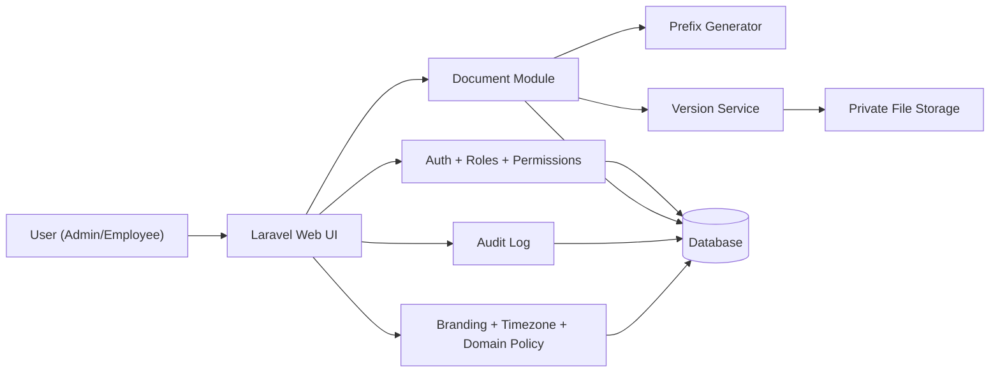

<div align="center">

# ECO DC

### Daxili Sənəd Dövriyyəsi Platforması (Single-Company)

[](https://laravel.com)
[](https://www.php.net)
[](https://vitejs.dev)
[](https://tailwindcss.com)
[](#tehlukesizlik-standartlari)
[](./DEPLOY_SHARED_HOSTING.md)
[](./DEPLOY_RAILWAY.md)
[](#coxdillilik-i18n)

</div>

## Məzmun
- [Layihə Haqqında](#layihe-haqqinda)
- [Əsas Xüsusiyyətlər](#esas-xususiyyetler)
- [Prefiks Standartı](#prefiks-standarti)
- [Rol Modeli](#rol-modeli)
- [Arxitektura](#arxitektura)
- [Texnologiya Stack-i](#texnologiya-stack-i)
- [Sürətli Lokal Qurulum](#surətli-lokal-qurulum)
- [Lokal Serverin Başladılması](#lokal-serverin-basladilmasi)
- [Konfiqurasiya (.env)](#konfiqurasiya-env)
- [Admin Panel Modulları](#admin-panel-modullari)
- [Təhlükəsizlik Standartları](#tehlukesizlik-standartlari)
- [Test və Keyfiyyət](#test-ve-keyfiyyet)
- [Railway Deploy](#railway-deploy)
- [Shared Hosting Deploy](#shared-hosting-deploy)
- [Çoxdillilik (i18n)](#coxdillilik-i18n)
- [Layihə Strukturunun Qısa Xəritəsi](#layihe-strukturunun-qisa-xeritesi)
- [Əməliyyat Komandaları](#emeliyyat-komandalari)
- [Lisenziya](#lisenziya)

## Layihə Haqqında
**ECO DC** şirkət daxilində sənəd dövriyyəsini idarə etmək üçün hazırlanmış, mobile-first və shared-hosting uyğun platformadır.

Sistem modeli:
- Single-company (hər quraşdırma bir şirkət üçündür)
- Tək domain üzərindən giriş
- Login yalnız aktiv istifadəçilər üçün
- Self-register və "şifrəni unutdum" funksiyası yoxdur

## Əsas Xüsusiyyətlər
- `Login` və aktiv user yoxlanışı (`is_active`)
- `Domain restriction`: yalnız branding-də təyin olunan email domain ilə giriş
- Sənəd yaratma, redaktə, silmə
- Real-time prefiks önizləmə və copy
- Sənəd siyahısı üçün filterlər:
  - sənəd adı
  - istifadəçi
  - kateqoriya
  - qovluq
  - tarix intervalı
- Pagination ilə standart siyahılama
- Fayl versiyalaşdırma:
  - drag & drop upload
  - versiya qeydi
  - yükləyən istifadəçi məlumatı
  - versiya tarixi
  - versiya silmə
- Admin panel:
  - istifadəçi idarəetməsi
  - rol/icazə idarəetməsi
  - kateqoriya idarəetməsi (çoxdilli)
  - qovluq idarəetməsi (ana/alt, çoxdilli)
  - branding ayarları (logo, favicon, rəng, timezone, domain)
  - audit log və CSV export

## Prefiks Standartı
Sənəd kodu aşağıdakı formatla generasiya olunur:

```text
ECP-{QOVLUQ}/{KATEQORIYA}-{YYYY}/{0001}
```

Nümunə:

```text
ECP-MAIN/HR-2026/0001
```

## Rol Modeli
| Rol | Giriş səviyyəsi | Qeyd |
|---|---|---|
| `admin` | Tam giriş | User, branding, audit, icazələr, kateqoriya/qovluq idarəetməsi |
| `employee` | Məhdud giriş | Verilmiş icazələr çərçivəsində sənəd əməliyyatları |

Əlavə qayda:
- Admin yaradılmış sənədləri idarə edə bilər.
- İstifadəçi öz yaratdığı sənədləri redaktə/silə bilər.

## Arxitektura


## Texnologiya Stack-i
- **Backend:** Laravel 12, PHP 8.2+
- **Frontend:** Blade, Tailwind CSS, Alpine.js, Vite
- **Authorization:** spatie/laravel-permission
- **Audit:** spatie/laravel-activitylog
- **Database:** SQLite (lokal) və ya MySQL/MariaDB (production/shared hosting)
- **Storage:** local private disk (`storage/app/private`) + public branding asset-ləri

## Sürətli Lokal Qurulum
### 1) Asılılıqlar
```bash
composer install
npm install
```

### 2) Environment
```bash
cp .env.example .env
php artisan key:generate
```

### 3) Database
SQLite üçün:
```bash
touch database/database.sqlite
```

Sonra:
```bash
php artisan migrate --force
php artisan db:seed --force
php artisan storage:link
```

## Lokal Serverin Başladılması
İki terminal ilə tövsiyə edilən iş rejimi:

Terminal 1 (Laravel):
```bash
php artisan serve --host=127.0.0.1 --port=8080
```

Terminal 2 (Vite):
```bash
npm run dev -- --host 127.0.0.1 --port 5173
```

Açılış:
- App: [http://127.0.0.1:8080](http://127.0.0.1:8080)
- Vite: [http://127.0.0.1:5173](http://127.0.0.1:5173)

## Konfiqurasiya (.env)
Ən vacib dəyişənlər:

```env
APP_NAME="ECO DC"
APP_ENV=production
APP_DEBUG=false
APP_URL=https://your-domain.az

APP_LOCALE=az
APP_FALLBACK_LOCALE=en
APP_AVAILABLE_LOCALES=az,en
APP_TIMEZONE=UTC

DB_CONNECTION=mysql
DB_HOST=127.0.0.1
DB_PORT=3306
DB_DATABASE=eco_dc
DB_USERNAME=eco_dc_user
DB_PASSWORD=change-me

SESSION_DRIVER=database
SESSION_ENCRYPT=true
SESSION_SECURE_COOKIE=true
SESSION_HTTP_ONLY=true
SESSION_SAME_SITE=strict

ALLOWED_LOGIN_DOMAIN=company.az
ADMIN_EMAIL=admin@company.az
ADMIN_PASSWORD=ChangeMeStrongPassword123!
```

Tövsiyə:
- Production mühitdə `APP_DEBUG=false` saxlayın.
- `ADMIN_PASSWORD` ilk deploydan sonra dərhal dəyişdirin.

## Admin Panel Modulları
- **Users:** yarat, yenilə, aktiv/deaktiv et, şifrə reset et
- **Permissions:** employee rolunun icazələrini idarə et
- **Categories:** çoxdilli kateqoriya adları və sıralama
- **Folders:** ana/alt qovluq strukturu və çoxdilli adlar
- **Branding:** şirkət adı, rənglər, timezone, logo (SVG daxil), favicon, login domain
- **Audit Logs:** filter + CSV export

## Təhlükəsizlik Standartları
Layihədə tətbiq edilən əsas tədbirlər:
- Auth + role/permission yoxlamaları
- Aktiv user məcburiyyəti (`is_active`)
- Login domain məhdudiyyəti (`allowed_login_domain`)
- Login rate limit
- File upload validation + ölçü/format məhdudiyyəti
- SVG fayllar üçün təhlükəli tag/attribute bloklaması
- Fayl yükləmədə `sha256` integrity yoxlaması (download zamanı)
- Secure headers middleware:
  - `Content-Security-Policy`
  - `X-Frame-Options`
  - `X-Content-Type-Options`
  - `Referrer-Policy`
  - `Permissions-Policy`
  - `Strict-Transport-Security` (HTTPS)
- Auth edilmiş cavablarda `no-store` cache siyasəti
- Kritik əməliyyatların audit loglanması

## Test və Keyfiyyət
```bash
php artisan test
npm run build
composer audit
npm audit --omit=dev --audit-level=high
```

## Railway Deploy
Railway üçün Docker əsaslı yayımlama hazırdır:
- [DEPLOY_RAILWAY.md](./DEPLOY_RAILWAY.md)

Bu axında:
- `Dockerfile` ilə build
- Vite asset build (`public/build/manifest.json`)
- Runtime migrate/cache əməliyyatları
- `APP_KEY` boş olduqda runtime auto-generate + persist (`LARAVEL_STORAGE_PATH`)
- `$PORT` üzərindən start
- Persistent volume dəstəyi (`LARAVEL_STORAGE_PATH=/data/storage`)
- Railway startup sabitliyi üçün `RUN_MIGRATIONS_ON_BOOT=false` tövsiyəsi

## Shared Hosting Deploy
Shared hosting üçün tam təlimat:
- [DEPLOY_SHARED_HOSTING.md](./DEPLOY_SHARED_HOSTING.md)

Əhatə edir:
- public/ qovluq yönləndirməsi
- production `.env`
- migrate/seed prosesi
- cache optimize
- təhlükəsizlik checklist

## Çoxdillilik (i18n)
Sistem default olaraq Azərbaycan dilindədir, lakin genişlənən struktura malikdir.

Dillər:
- `APP_AVAILABLE_LOCALES=az,en,...`
- UI mətnləri: `lang/{locale}/ui.php`, `lang/{locale}/messages.php`
- Kateqoriya və qovluqlarda `name_translations` strukturu

## Layihə Strukturunun Qısa Xəritəsi
```text
app/
  Http/Controllers/
  Http/Middleware/
  Services/
  Models/
resources/
  views/
  css/
  js/
lang/
  az/
  en/
database/
  migrations/
  seeders/
public/
```

## Əməliyyat Komandaları
```bash
# Lokal full dev (composer script)
composer run dev

# Migration + seed
php artisan migrate --force
php artisan db:seed --force

# Build
npm run build

# Config və route cache (production)
php artisan config:cache
php artisan route:clear
php artisan view:cache
```

## Lisenziya
Bu repository şirkətdaxili istifadəyə yönəlib.
Açıq mənbə və kommersiya istifadəsi üçün ayrıca hüquqi razılaşma tələb olunur.
